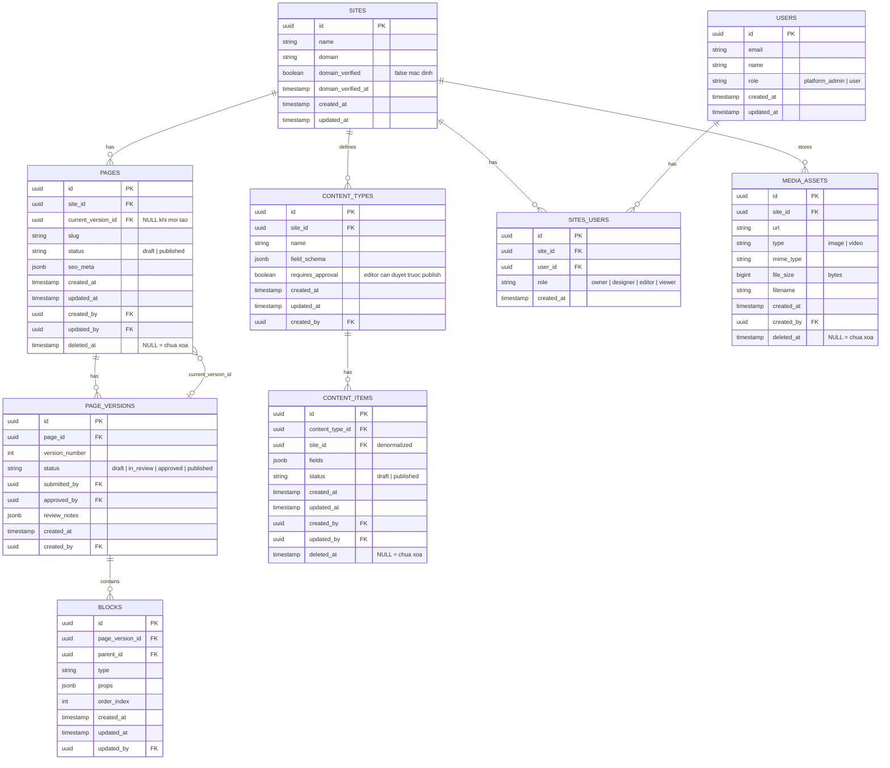

# ERD & Database Schema — Nền tảng CMS kéo-thả
> **Phiên bản:** v0.2 — Cập nhật sau SA Review (17/08/2026)  
> **Thay đổi so với v0.1:** Bổ sung `current_version_id`, `site_id` trên `content_items`, `domain_verified` trên `sites`, audit fields, soft delete, index, migration script.

---

## Mermaid ERD



## Giải thích từng bảng

| Bảng | Mục đích | Ghi chú kỹ thuật |
|---|---|---|
| `sites` | 1 site = 1 website khách hàng, gốc của mọi dữ liệu multi-tenant | `domain_verified` — Renderer Edge Middleware check trước khi serve |
| `users` | Tài khoản người dùng | `role = platform_admin` có quyền can thiệp toàn bộ site (support/billing) |
| `sites_users` | Vai trò của user theo từng site | `role` quyết định quyền thao tác — xem RBAC matrix. Thêm `viewer` so với v0.1 |
| `pages` | Danh sách trang trong 1 site | `slug` unique theo `site_id`; `current_version_id` trỏ bản đang live để rollback |
| `page_versions` | Version hóa nội dung trang | `submitted_by ≠ approved_by` enforce check-and-balance, không tự duyệt được |
| `blocks` | Cây block trong 1 page_version (kéo-thả) | `parent_id` self-ref cho block lồng nhau; validate không tạo vòng tham chiếu |
| `content_types` | Định nghĩa loại nội dung tùy chỉnh | `requires_approval` cho phép cấu hình editor publish trực tiếp hay cần duyệt |
| `content_items` | Dữ liệu thực tế theo content_type | `site_id` denormalized — mọi query filter ngay, không join qua `content_types` |
| `media_assets` | File ảnh/video | `file_size` + `mime_type` để enforce storage quota theo gói dịch vụ |

---

## Index cần tạo

> Index là bắt buộc với multi-tenant — mọi query đều filter theo `site_id`, thiếu index gây full table scan khi dữ liệu lớn.

```sql
-- PAGES
CREATE INDEX idx_pages_site_id          ON pages(site_id) WHERE deleted_at IS NULL;
CREATE UNIQUE INDEX idx_pages_slug      ON pages(site_id, slug) WHERE deleted_at IS NULL;

-- PAGE_VERSIONS
CREATE INDEX idx_pv_page_id_status      ON page_versions(page_id, status);
CREATE INDEX idx_pv_page_id_version     ON page_versions(page_id, version_number DESC);

-- BLOCKS
CREATE INDEX idx_blocks_version_id      ON blocks(page_version_id);
CREATE INDEX idx_blocks_parent_id       ON blocks(parent_id);

-- CONTENT_ITEMS
CREATE INDEX idx_ci_site_id             ON content_items(site_id) WHERE deleted_at IS NULL;
CREATE INDEX idx_ci_content_type_status ON content_items(content_type_id, status) WHERE deleted_at IS NULL;
CREATE INDEX idx_ci_content_type_date   ON content_items(content_type_id, created_at DESC) WHERE deleted_at IS NULL;

-- MEDIA_ASSETS
CREATE INDEX idx_media_site_id          ON media_assets(site_id) WHERE deleted_at IS NULL;

-- SITES_USERS
CREATE INDEX idx_su_user_id             ON sites_users(user_id);
CREATE INDEX idx_su_site_id             ON sites_users(site_id);
```

---

## Quyết định thiết kế

| Quyết định | Lý do |
|---|---|
| `JSONB` cho `blocks.props`, `field_schema`, `fields` | Thêm field mới không cần migrate schema |
| `page_versions` tách riêng khỏi `pages` | Giữ lịch sử — rollback chỉ cần đổi `current_version_id` |
| `content_items.site_id` denormalized | Multi-tenant isolation: mọi query filter được ngay, không cần join qua `content_types` |
| Soft delete (`deleted_at`) thay vì hard delete | Cho phép recover khi xóa nhầm; scheduled job dọn sau 30 ngày |
| `submitted_by ≠ approved_by` trên `page_versions` | Check-and-balance: người gửi review không tự duyệt được |
| `users.role = platform_admin` | Nhân viên support có thể can thiệp tất cả site mà không cần vào DB trực tiếp |
| `domain_verified` trên `sites` | Renderer Edge Middleware cần biết domain đã CNAME đúng chưa trước khi serve |
| `content_types.requires_approval` | Cấu hình linh hoạt per content type: editor publish thẳng hay phải qua duyệt |

---

## Migration Script (v0.1 → v0.2)

```sql
BEGIN;

-- 1. SITES
ALTER TABLE sites
  ADD COLUMN domain_verified    BOOLEAN   NOT NULL DEFAULT FALSE,
  ADD COLUMN domain_verified_at TIMESTAMP,
  ADD COLUMN updated_at         TIMESTAMP NOT NULL DEFAULT NOW();

-- 2. USERS
ALTER TABLE users
  ADD COLUMN role       VARCHAR(20) NOT NULL DEFAULT 'user'
             CHECK (role IN ('platform_admin', 'user')),
  ADD COLUMN updated_at TIMESTAMP NOT NULL DEFAULT NOW();

-- 3. PAGES
ALTER TABLE pages
  ADD COLUMN current_version_id UUID REFERENCES page_versions(id),
  ADD COLUMN updated_at         TIMESTAMP NOT NULL DEFAULT NOW(),
  ADD COLUMN created_by         UUID REFERENCES users(id),
  ADD COLUMN updated_by         UUID REFERENCES users(id),
  ADD COLUMN deleted_at         TIMESTAMP;

-- 4. PAGE_VERSIONS
ALTER TABLE page_versions
  ADD COLUMN submitted_by UUID REFERENCES users(id),
  ADD COLUMN approved_by  UUID REFERENCES users(id),
  ADD COLUMN review_notes JSONB,
  ADD COLUMN created_by   UUID REFERENCES users(id);

-- 5. BLOCKS
ALTER TABLE blocks
  ADD COLUMN created_at TIMESTAMP NOT NULL DEFAULT NOW(),
  ADD COLUMN updated_at TIMESTAMP NOT NULL DEFAULT NOW(),
  ADD COLUMN updated_by UUID REFERENCES users(id);

-- 6. CONTENT_TYPES
ALTER TABLE content_types
  ADD COLUMN requires_approval BOOLEAN NOT NULL DEFAULT FALSE,
  ADD COLUMN updated_at        TIMESTAMP NOT NULL DEFAULT NOW(),
  ADD COLUMN created_by        UUID REFERENCES users(id);

-- 7. SITES_USERS — thêm viewer role
ALTER TABLE sites_users
  DROP CONSTRAINT IF EXISTS sites_users_role_check;
ALTER TABLE sites_users
  ADD CONSTRAINT sites_users_role_check
  CHECK (role IN ('owner', 'designer', 'editor', 'viewer'));

-- 8. CONTENT_ITEMS: thêm site_id denormalized
ALTER TABLE content_items
  ADD COLUMN site_id    UUID REFERENCES sites(id),
  ADD COLUMN updated_at TIMESTAMP NOT NULL DEFAULT NOW(),
  ADD COLUMN created_by UUID REFERENCES users(id),
  ADD COLUMN updated_by UUID REFERENCES users(id),
  ADD COLUMN deleted_at TIMESTAMP;

-- Backfill site_id từ content_types
UPDATE content_items ci
SET site_id = ct.site_id
FROM content_types ct
WHERE ci.content_type_id = ct.id;

ALTER TABLE content_items ALTER COLUMN site_id SET NOT NULL;

-- 9. MEDIA_ASSETS
ALTER TABLE media_assets
  ADD COLUMN mime_type  VARCHAR(100),
  ADD COLUMN file_size  BIGINT,
  ADD COLUMN filename   VARCHAR(255),
  ADD COLUMN created_at TIMESTAMP NOT NULL DEFAULT NOW(),
  ADD COLUMN created_by UUID REFERENCES users(id),
  ADD COLUMN deleted_at TIMESTAMP;

-- 10. Tạo Index
CREATE INDEX idx_pages_site_id          ON pages(site_id) WHERE deleted_at IS NULL;
CREATE UNIQUE INDEX idx_pages_slug      ON pages(site_id, slug) WHERE deleted_at IS NULL;
CREATE INDEX idx_pv_page_id_status      ON page_versions(page_id, status);
CREATE INDEX idx_pv_page_id_version     ON page_versions(page_id, version_number DESC);
CREATE INDEX idx_blocks_version_id      ON blocks(page_version_id);
CREATE INDEX idx_blocks_parent_id       ON blocks(parent_id);
CREATE INDEX idx_ci_site_id             ON content_items(site_id) WHERE deleted_at IS NULL;
CREATE INDEX idx_ci_content_type_status ON content_items(content_type_id, status) WHERE deleted_at IS NULL;
CREATE INDEX idx_ci_content_type_date   ON content_items(content_type_id, created_at DESC) WHERE deleted_at IS NULL;
CREATE INDEX idx_media_site_id          ON media_assets(site_id) WHERE deleted_at IS NULL;
CREATE INDEX idx_su_user_id             ON sites_users(user_id);
CREATE INDEX idx_su_site_id             ON sites_users(site_id);

COMMIT;
```

---

## Cleanup Job (Scheduled — 2:00 AM mỗi đêm)

```sql
-- 1. Xóa page_versions nháp cũ (giữ 30 bản + 90 ngày theo NFR)
DELETE FROM page_versions
WHERE status != 'published'
  AND created_at < NOW() - INTERVAL '90 days'
  AND version_number < (
    SELECT MAX(v2.version_number) - 30
    FROM page_versions v2
    WHERE v2.page_id = page_versions.page_id
  );

-- 2. Xóa cứng soft-deleted records sau 30 ngày
DELETE FROM pages         WHERE deleted_at < NOW() - INTERVAL '30 days';
DELETE FROM content_items WHERE deleted_at < NOW() - INTERVAL '30 days';
DELETE FROM media_assets  WHERE deleted_at < NOW() - INTERVAL '30 days';
```

---

## Bảng `orders` / `order_items` — Giai đoạn 2 (Sprint 7–8)

Chưa đưa vào schema này để giữ tập trung vào MVP.

---

*Schema v0.2 — Cập nhật theo SA Review 17/08/2026*
