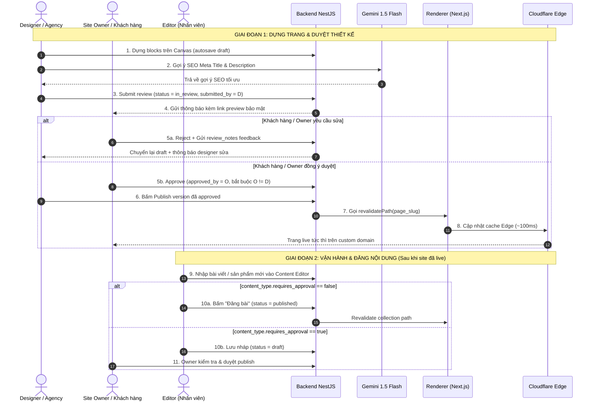

# Đặc tả nghiệp vụ — Nền tảng CMS kéo-thả
> **Phiên bản:** v0.2 — Cập nhật sau SA Review (17/08/2026)  
> **Thay đổi chính:** Đồng bộ với kiến trúc Renderer Multi-tenant (ADR-001), AI Gemini Layer (ADR-002), RBAC Check-and-Balance, và cờ `requires_approval`.

---

## 1. Content Type Definition Template

Dùng bảng này làm mẫu định nghĩa mỗi khi cần tạo 1 Content Type mới trên hệ thống trước khi cấu hình trên builder.

### Thuộc tính Content Type
- **Tên:** (VD: Bài viết blog, Sản phẩm, Đối tác, Tuyển dụng...)
- **Cờ `requires_approval`:** `true` (editor đăng bài phải qua owner/designer duyệt) hoặc `false` (editor được tự publish trực tiếp).

---

### Ví dụ 1: Content Type "Bài viết" (Blog)
- **requires_approval:** `false` (editor được tự do đăng bài)

| Field key | Label hiển thị | Kiểu dữ liệu | Bắt buộc | Ghi chú |
|---|---|---|---|---|
| `title` | Tiêu đề | text | ✅ | Dùng làm `title_field` trong block `collection_list` |
| `slug` | Đường dẫn | text | ✅ | Tự sinh từ title, cho phép chỉnh sửa thủ công |
| `cover_image` | Ảnh đại diện | image | ✅ | Dùng làm `image_field` |
| `excerpt` | Mô tả ngắn | text | ❌ | Gợi ý tự động qua AI (`POST /ai/suggest/excerpt`) |
| `body` | Nội dung | richtext | ✅ | Trình soạn thảo văn bản phong phú |
| `category` | Danh mục | text (select) | ❌ | Danh sách giá trị chọn sẵn (Tin tức, Khuyến mãi, Hướng dẫn...) |
| `published_at` | Ngày đăng | date | ❌ | Mặc định = thời điểm bấm publish |

---

### Ví dụ 2: Content Type "Sản phẩm"
- **requires_approval:** `true` (giá và thông tin sản phẩm cần duyệt trước khi hiển thị)

| Field key | Label hiển thị | Kiểu dữ liệu | Bắt buộc | Ghi chú |
|---|---|---|---|---|
| `name` | Tên sản phẩm | text | ✅ | Tên hiển thị chính |
| `price` | Giá (VNĐ) | number | ✅ | Đơn vị VNĐ, validate >= 0 |
| `original_price` | Giá gốc / Niêm yết | number | ❌ | Dùng hiển thị giá gạch ngang khuyến mãi |
| `gallery` | Bộ ảnh sản phẩm | image (nhiều) | ✅ | Tối thiểu 1 ảnh, upload qua presigned URL |
| `description` | Mô tả chi tiết | richtext | ❌ | Thông số, hướng dẫn sử dụng |
| `sku` | Mã sản phẩm | text | ❌ | Mã SKU quản lý kho |
| `in_stock` | Tình trạng còn hàng | boolean | ✅ | Mặc định: `true` |

---

## 2. User Flow & Quy trình Nghiệp vụ

### Các quy tắc nghiệp vụ cốt lõi (Business Rules)
1. **Quy tắc phân lập kiểm soát (Check-and-Balance Approval):**
   - Designer gửi duyệt (`submitted_by`) **không thể tự bấm duyệt** (`approved_by`).
   - Bắt buộc `owner` của site (hoặc `platform_admin`) mới có thẩm quyền approve.
2. **Quy tắc cô lập dữ liệu (Multi-tenant Isolation):**
   - Người dùng ở site A tuyệt đối không thể xem, sửa hoặc xóa trang, media, bài viết của site B.
   - Mọi request API đều được giải mã `site_id` từ token/context và kiểm tra quyền qua RBAC Guard.
3. **Quy tắc toàn vẹn cấu trúc (Layout Lockdown for Editors):**
   - Editor chỉ có quyền nhập liệu vào các Content Types đã được Designer dựng sẵn.
   - Editor **không có quyền** truy cập Canvas Editor Engine, không sửa đổi cây Block hoặc can thiệp CSS/layout.

---

## 3. Quy trình Trợ lý AI (Gemini AI Layer — ADR-002)

### 3.1. Tự động gợi ý SEO Meta khi Publish
- **Kích hoạt:** Khi Designer chuẩn bị submit hoặc publish trang.
- **Đầu vào:** Toàn bộ text trích xuất từ cây blocks của trang (tối đa 4,000 ký tự).
- **Mô hình:** `gemini-1.5-flash` qua endpoint `https://generativelanguage.googleapis.com`.
- **Đầu ra:**
  - `meta_description`: Đoạn mô tả chuẩn SEO (120–160 ký tự, tiếng Việt tự nhiên).
  - `title_suggestion`: Tiêu đề trang tối ưu từ khóa tìm kiếm (40–60 ký tự).
- **Fallback:** Nếu API Gemini bận hoặc timeout (>5 giây), hệ thống tự động trích xuất 160 ký tự đầu tiên của đoạn văn bản đầu tiên làm description, không block luồng người dùng.

### 3.2. Tự động gợi ý Excerpt cho Editor
- **Kích hoạt:** Khi Editor nhập nội dung bài viết trong Content Editor UI và bấm nút "✨ AI tóm tắt".
- **Đầu vào:** Nội dung `body` của bài viết.
- **Đầu ra:** Đoạn tóm tắt súc tích 2–3 câu (tối đa 250 ký tự) điền vào ô `excerpt`.

---

## 4. Yêu cầu Phi Chức Năng (Non-Functional Requirements — NFR)

| Hạng mục | Tiêu chuẩn cam kết | Giải pháp kỹ thuật bảo đảm |
|---|---|---|
| **Tốc độ tải trang live (LCP)** | < 2.0 giây trên mạng 4G VN | Next.js App Router ISR + Cloudflare Edge Caching |
| **Thời gian Publish Live** | < 500ms (kỳ vọng ~100ms) | Revalidate theo path thay vì re-build toàn bộ site |
| **Bảo mật Multi-tenant** | 0% rủi ro data leak giữa các tenant | `site_id` denormalized trên mọi bảng + RBAC Middleware + Unit tests multi-tenant |
| **Bảo mật SSRF & XSS** | Chặn đứng webhook tự do & input rác | Webhook whitelist via ID + DOMPurify sanitize rich-text |
| **Dung lượng Media Quota** | Enforce theo gói tài khoản (VD: 2GB–50GB) | Check dung lượng tại API presigned URL trước khi cấp link upload MinIO |
| **Thời gian lưu trữ Version** | Tối thiểu 30 bản hoặc 90 ngày | Scheduled DB cleanup job chạy lúc 2:00 AM hàng ngày |
| **Observability & Giám sát** | 100% request có trace log | Pino Structured JSON Logs + X-Request-ID + Prometheus metrics |
| **Độ sẵn sàng (Uptime)** | >= 99.5% cho website live | Nginx reverse proxy + Cloudflare CDN static failover cache |

---

## 5. Bảng Đối Chiếu Trạng Thái & Lịch Sử Feedback

| Trang | Version | Người tạo | Người duyệt | Trạng thái | Ghi chú feedback |
|---|---|---|---|---|---|
| Trang chủ | v3 | Designer A | Owner B | `published` | Đã duyệt và kích hoạt live trên domain |
| Về chúng tôi | v1 | Designer A | — | `in_review` | Đang chờ khách kiểm tra phần hình ảnh đội ngũ |
| Liên hệ | v2 | Designer A | Owner B | `approved` | Đã sửa màu nút CTA theo yêu cầu, sẵn sàng publish |
| Dịch vụ | v1 | Designer A | — | `draft` | Đang trong quá trình dựng layout blocks |

---

*Tài liệu đặc tả nghiệp vụ v0.2 — Đã đồng bộ toàn diện với SA Review Report.*
